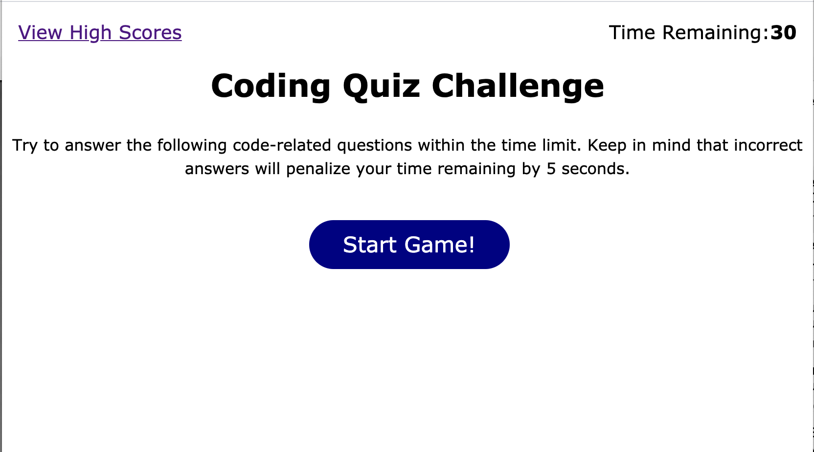
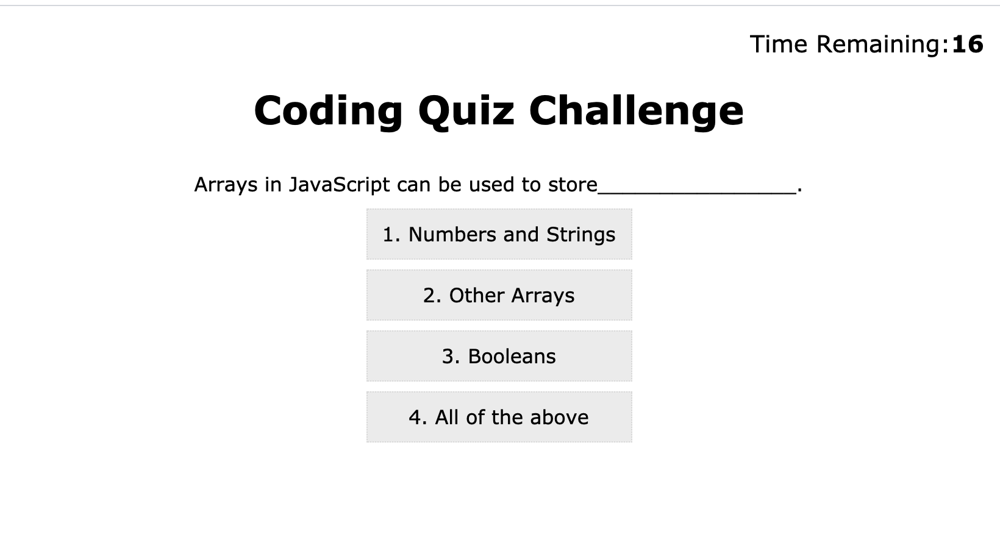
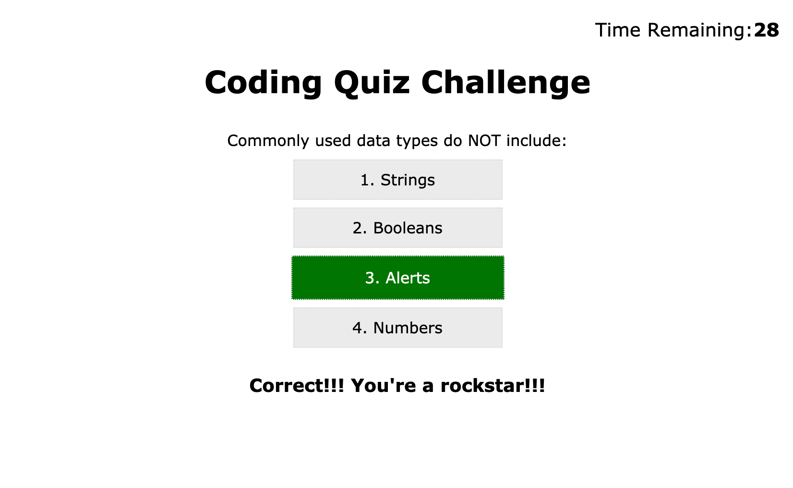
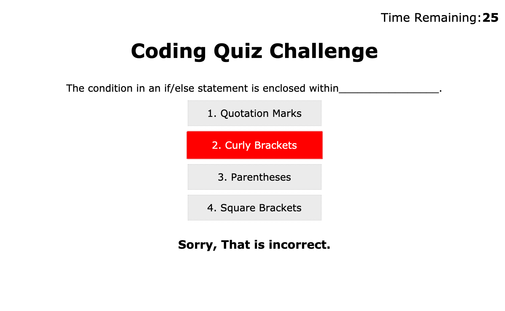
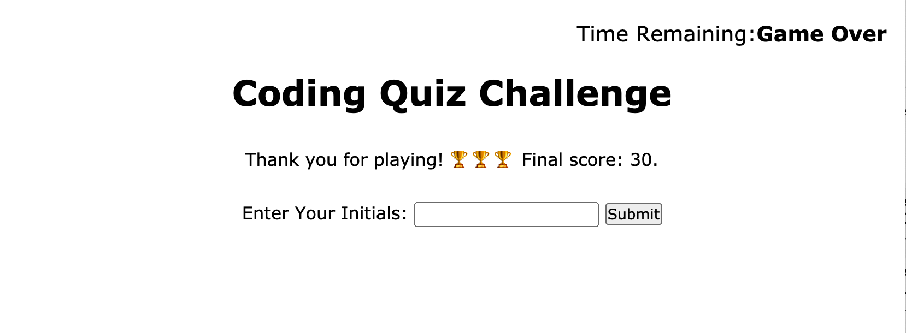
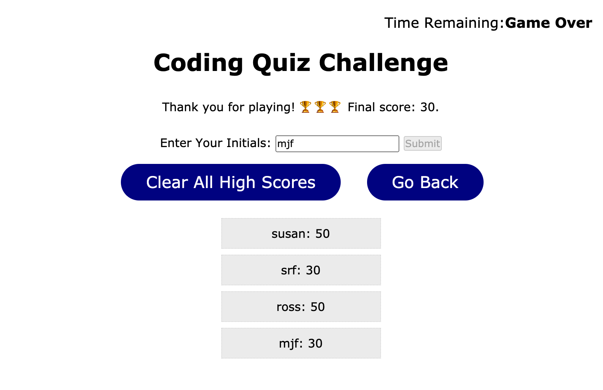

# Susan Fujii's Timed Javascript Quiz

## Table of Contents

- [Description](#Description)
- [Motivation and the Problem I am Solving](#Motivation-and-the-Problem-I-am-Solving)
- [Why I Built This](#Why-I-Built-This)
- [What I Learned](#What-I-Learned)
- [Installation](#Installation)
- [Usage](#Usage)
- [Screenshots](#Screenshots)
- [Credits](#Credits)
- [License](#License)
- [Features](#Features)
- [Contribute](#How-to-Contribute)

## Description

The purpose of this project is to **create an interactive timed JavaScript Quiz** to simulate coding assessments and interview questions that developers might be asked along their destination to becoming full-stack web developers. This app runs in the browser and features dynamically updated HTML and CSS that is powered by JavaScript code. It has a clean, responsive user interface that adapts to multiple screen sizes. It presents the user with a series of multiple-choice questions, lets them know whether they answered each question correctly or incorrectly, and shows them their score at the end of the game. Players lose 5 seconds each time they answer a question incorrectly, and the game ends when they have either answered all of the questions or the timer has run out. At the end of the game, players are invited to enter their initials in to see the list of high scores and compare how they did to others who have played the game. Users may also click on "View High Scores" from the initial "Play Game" window to check out the current high scores before playing. At the end of the game, players may also clear all high scores from local storage, and of course return to the beginning to play again! 

### Motivation and the Problem I am Solving

Often, developers are asked to respond to interactive coding quizzes and technical interviews as part of the interview process for hiring managers. This timed online quiz (especially when it is flushed out with more questions and functionality) :-) will be a great way for developers to test their skills agains other developers and see how they measure up! 

### Why I Built This

This was a great project to begin to see how synchronous and asynchronous JavaScript work together. The user is presented the questions/answers in sequential order, but the JavaScript code is listening to see which buttons/answers they have clicked at any particular time and then giving the user feedback and presenting a new question. 

This web application is **accessible** to users who will view it both on larger computer screens and also on smaller screen sizes, and the code is **up to current industry standards** and **uses best known practices**.

**Accessibility** is an increasingly important consideration. Web accessibility ensures that people with disabilities can access a website using assistive technologies like video captions, screen readers, and braille keyboards. **Accessible** sites also rank higher in search engines and ensure that **all** users can easily access the information provided.

### What I Learned

This was a challenging and fun project! It required a lot of logic, a lot of design considerations, working with the DOM (without using JQuery or Bootstrap), looping, working with event listeners and timers, saving/retrieving/clearing from localStorage, and much more. I spent a LOT of time learning to work with each of these and to implement them in a way that works and makes sense.

## Installation
To view this project, simply visit (https://srfujii.github.io/Timed_JavaScript_Coding_Quiz/index.html)
 
To install this project on your local machine, simply visit this repo at (https://github.com/srfujii/Timed_JavaScript_Coding_Quiz) and use git to clone it to your local environment.

## Usage
This app is pretty self-explanatory-- simply click the "Start Game!" button to start the game, then click on the answer you think is correct for each question presented. You can enter in your initials to save your score at the end of the game, and can view all of the high scores (or clear them all out) at the end of the game. 

## Screenshots
Here are some screenshots for you to preview how the password generator looks and feels:

### Quiz Game UI:

## Credits

1. [Rice Technology Bootcamp](https://techbootcamps.rice.edu/)

### JavaScript Resources:

1. [How to Clear Items from LocalStorage](https://www.w3docs.com/snippets/javascript/how-to-clear-local-storage-javascript.html)
2. [How to Submit Forms only Once](https://stackoverflow.com/questions/2545641/how-to-submit-form-only-once-after-multiple-clicking-on-submit/2545653)
3. [Non-Navigating Links for JavaScript Handling](https://weblog.west-wind.com/posts/2019/Jan/21/NonNavigating-Links-for-JavaScript-Handling)
4. [Introduction to Web API's | MDN](https://developer.mozilla.org/en-US/docs/Learn/JavaScript/Client-side_web_APIs/Introduction)
5. [Passing Parameters to Event Listeners](https://www.w3schools.com/js/js_htmldom_eventlistener.asp)
6. [Delay, Sleep, Pause, and Wait in JavaScript](https://weblog.west-wind.com/posts/2019/Jan/21/NonNavigating-Links-for-JavaScript-Handling)

## License
[MIT License](./license.txt)

## Features

<ol>
    <li>Semantic HTML implemented in HTML and CSS</li>
    <li>ELements follow logical structure</li>
    <li>Comments added before each CSS element and HTML section</li>
    <li>All buttons and links work</li>
    <li>Title is concise and descriptive</li>
    <li>Quiz is timed</li>
    <li>5 seconds deducted from time for each question answered incorrectly</li>
    <li>High scores are stored</li>
    <li>High scores are displayed when user submits their score or when View High Scores is clicked</li>
    <li>Start button starts game, Clear All High Scores buttons clears scores from local storage and on screen</li>
    <li>Play Again and Go Back buttons start the game over from the beginning</li>
    <li>Questions are presented one after another</li>
    <li>Player is informed immediately whether they answered correctly or incorrectly</li>
    <li>Game ends when all questions are answered or timer runs out</li>
    <li>Game makes sure player does not submit blank initials</li>
    <li>Game ensures player does not enter multiple "high scores" per game</li>
    <li>When the web application is resized or viewed on various screens and devices, the responsive layout adapts to the user's screensize</li>
    <li>Accessibility: button backgrounds change background color on hover</li>
</ol>

## How to Contribute

